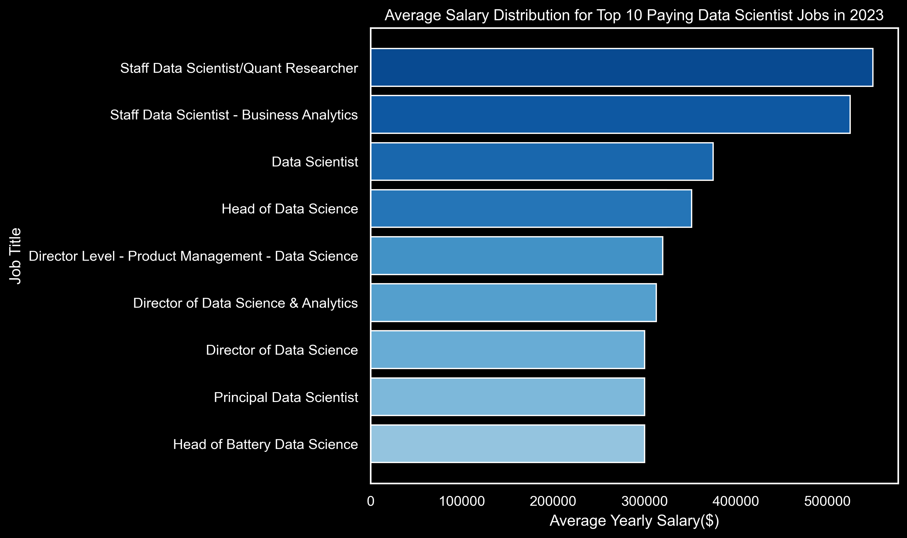
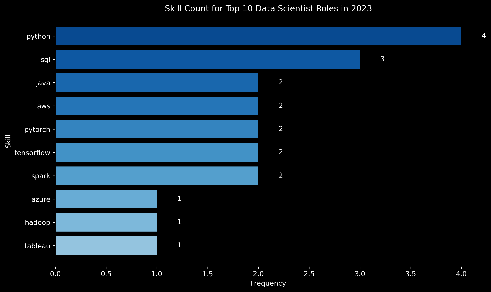

# Introduction

The demand for Data Scientists continues to grow as organizations increasingly rely on data to guide decision-making. Alongside this growth, remote work has opened access to high-paying Data Scientist roles across the global job market. Understanding which roles offer the highest salaries and which skills are most valued is essential for individuals looking to build or advance a career in Data Science.

This project analyzes Data Scientist job postings to identify the top-paying remote roles with specified salaries. It then examines the skills required for these high-paying positions to better understand which competencies are linked to higher earnings. In addition, the project explores the most in-demand skills across all Data Scientist job postings, providing insight into current market needs.

Finally, the analysis investigates how different skills relate to salary levels, highlighting skills that are both highly demanded and financially rewarding. By combining salary and demand insights, this project aims to guide job seekers in developing skills that offer strong career opportunities and long-term value in the Data Science field.

SQL Queries? Check them out here: [project_sql folder](/3_Project/)

# Background

This project was created to better understand the Data Scientist job market by identifying high-paying roles and the skills that employers value most. The motivation behind this analysis is to make job searching more efficient by using data to highlight roles and skills that offer the best career opportunities.

The dataset used in this project comes from a SQL course by Luke Barousse, which provides real-world job posting data, including job titles, salaries, locations, remote availability, and required skills.

Using SQL, this project focuses on answering five key questions:

1. What are the top-paying Data Scientist jobs?

2. What skills are required for these top-paying roles?

3. What skills are most in demand for Data Scientists?

4. Which skills are associated with higher salaries?

5. What are the most optimal skills to learn based on both demand and salary?

By answering these questions, the project aims to provide practical insights to help Data Scientists make informed decisions about skill development and career planning.

# Tools I used

For my deep dive into the data analyst job market, I harnessed the power of several key tools:

- **SQL**: The backbone of my analysis, allowing me to query the database and unearth critical insights.

- **PostgreSQL**: The chosen database management system, ideal for handling the job posting data.
Visual Studio Code: My go-to for database management and executing SQL queries.

- **Git & GitHub**: Essential for version control and sharing my SQL scripts and analysis, ensuring collaboration and project tracking.


# The Analysis

Each query in this project was designed to explore a specific facet of the Data Scientist job market. The goal was to uncover insights about salary levels, skill requirements, and market demand, using data-driven analysis to better understand career opportunities in the field. Here is how I approached each question:

### 1. Top Paying Data Scientist Jobs

To find the top-paying roles, I filtered Data Scientist positions by reported annual salary and location, with an emphasis on remote opportunities. This query highlights the most lucrative positions in the field.

```sql
SELECT
    job_id,
    job_title,
    job_location,
    job_schedule_type,
    salary_year_avg,
    job_posted_date,
    name AS company_name
FROM
    job_postings_fact
LEFT JOIN company_dim ON job_postings_fact.company_id= company_dim.company_id
WHERE
    job_title_short = 'Data Scientist' AND job_location = 'Anywhere'
    AND salary_year_avg IS NOT NULL
ORDER BY
    salary_year_avg DESC
LIMIT 10;
```
## Top Paying Data Scientist Jobs in 2023

This chart shows the **average yearly salary** for the top 10 paying Data Scientist roles in 2023.



## Insights from Top-Paying Remote Data Scientist Roles

- **Very high salary potential:** Remote Data Scientist roles can offer exceptional pay, with top salaries reaching around $550,000 per year, well above typical market averages.

- **Seniority matters:** The highest-paying positions are mostly senior or leadership roles (e.g., Staff, Head of Data Science, Director, Distinguished Data Scientist), showing that experience and strategic responsibility strongly influence compensation.

- **Strong presence in finance & analytics:** Companies such as Selby Jennings and Algo Capital Group indicate that quantitative finance and advanced analytics roles tend to be among the highest-paying.

- **Remote flexibility at the top:** All of these roles are listed as “Anywhere,” demonstrating that fully remote work is feasible even at the highest salary levels.

- **Industry diversity:** High-paying roles span multiple sectors, including finance, technology (Reddit, Walmart), product analytics, and energy, highlighting broad demand for advanced data science skills.

- **Leadership premium:** Multiple listings for Head or Director positions confirm a clear pay advantage for roles involving team management and strategic decision-making.

### Conclusion

- These results indicate that senior and leadership-level remote Data Scientist roles provide extremely competitive compensation, particularly in finance-driven and analytics-intensive organisations.


### 2. Skills for Top-Paying Data Scientist Roles

To identify the skills most valued in high-paying roles, I joined the job postings with the skills dataset. This query highlights the specific technical and analytical competencies that employers expect for senior and leadership-level positions. Understanding these skills provides insight into what is required to secure the highest-compensation opportunities in the field.

```sql
WITH top_paying_jobs AS (
    SELECT
        job_id,
        job_title,
        salary_year_avg,
        name AS company_name
    FROM
        job_postings_fact
    LEFT JOIN company_dim ON job_postings_fact.company_id= company_dim.company_id
    WHERE
        job_title_short = 'Data Scientist' AND job_location = 'Anywhere'
        AND salary_year_avg IS NOT NULL
    ORDER BY
        salary_year_avg DESC
    LIMIT 10
)

SELECT 
    top_paying_jobs.*,
    skills
FROM top_paying_jobs
INNER JOIN skills_job_dim ON top_paying_jobs.job_id = skills_job_dim.job_id
INNER JOIN skills_dim ON skills_job_dim.skill_id = skills_dim.skill_id
ORDER BY
    salary_year_avg DESC
```
## Top Skills for Top Data Scientist Roles

This chart shows the **top 10 most frequent skills** required across these high-paying Data Scientist positions.


## Analysis of Skills for Top-Paying Data Scientist Roles

- An examination of the top 10 highest-paying Data Scientist positions reveals that certain technical skills are closely associated with higher salaries. **Python** and **SQL** are the most commonly required skills, underscoring their importance for advanced data science work.

- In addition to these core skills, **cloud technologies** such as AWS and GCP frequently appear, particularly in senior and leadership roles. This suggests that high-paying positions often involve deploying, scaling, and managing data solutions in cloud environments.

- Experience with **big data tools** like Spark, Hadoop, and Cassandra is also common among top-paying roles, indicating that proficiency in large-scale data systems is a key factor in achieving higher compensation.

- While **machine learning frameworks** such as PyTorch, TensorFlow, and scikit-learn appear less frequently, their inclusion in certain roles highlights the need for specialized modeling skills in addition to general programming expertise.

### Conclusion

- Overall, the highest-paying Data Scientist jobs prioritise strong programming and data-querying skills, combined with cloud and big data expertise. These roles typically carry greater technical responsibility and influence over data systems, which is reflected in their higher salaries.


### 3. In-Demand Skills for Data Scientists

This query identifies the skills most frequently requested across Data Scientist job postings. It highlights the competencies currently in highest demand, providing insight into which skills are most valuable for job seekers in the field.

```sql
SELECT 
    skills,
    COUNT(skills_job_dim.job_id) AS demand_count
FROM job_postings_fact
INNER JOIN skills_job_dim ON job_postings_fact.job_id = skills_job_dim.job_id
INNER JOIN skills_dim ON skills_job_dim.skill_id = skills_dim.skill_id
WHERE
    job_title_short = 'Data Scientist' 
    AND job_work_from_home = TRUE
GROUP BY
    skills
ORDER BY
    demand_count DESC
LIMIT 5
```

## Table Representation of Top 5 In-Demand Skills

| Skill   | Demand Count |
|---------|-------------|
| Python  | 10,390      |
| SQL     | 7,488       |
| R       | 4,674       |
| AWS     | 2,593       |
| Tableau | 2,458       |


## Top 5 Most In-Demand Skills for Remote Data Scientists

- The query identifies the top 5 most in-demand skills for Data Scientists working remotely. **Python** leads by a large margin with 10,390 postings, followed by **SQL** (7,488) and **R** (4,674), showing that strong programming and data-handling abilities are highly valued.

- **Cloud skills** such as AWS (2,593) and **data visualisation tools** like Tableau (2,458) also appear in the top 5, indicating that employers increasingly expect familiarity with cloud platforms and the ability to communicate insights visually.

- **Conclusion:**  
  Overall, the results suggest that combining core programming skills with cloud and visualisation expertise is key for Data Scientists in today’s job market.

### 4. Skills Based on Salary:

This query examines the average salaries linked to specific skills in Data Scientist job postings. It reveals which skills are associated with the highest compensation, providing insight into the technical competencies that can most influence earning potential.

```sql
SELECT 
    skills,
    ROUND(AVG(salary_year_avg), 0) AS avg_salary
FROM job_postings_fact
INNER JOIN skills_job_dim ON job_postings_fact.job_id = skills_job_dim.job_id
INNER JOIN skills_dim ON skills_job_dim.skill_id = skills_dim.skill_id
WHERE
    job_title_short = 'Data Scientist' AND salary_year_avg IS NOT NULL
    -- AND job_work_from_home = TRUE
GROUP BY
    skills
ORDER BY
     avg_salary DESC
LIMIT 25
```
## Table Representation of Skills and Average Salaries

| Skill           | Average Salary (USD) |
|-----------------|-------------------|
| Asana           | 215,477           |
| Airtable        | 201,143           |
| RedHat          | 189,500           |
| Watson          | 187,417           |
| Elixir          | 170,824           |
| Lua             | 170,500           |
| Slack           | 168,219           |
| Solidity        | 166,980           |
| Ruby on Rails   | 166,500           |
| RShiny          | 166,436           |
| Notion          | 165,636           |
| Objective-C     | 164,500           |
| Neo4j           | 163,971           |
| dplyr           | 163,111           |
| Hugging Face    | 160,868           |
| DynamoDB        | 160,581           |
| Haskell         | 157,500           |
| Unity           | 156,881           |
| Airflow         | 155,878           |
| CodeCommit      | 154,684           |
| Unreal          | 153,278           |
| Theano          | 153,133           |
| Zoom            | 151,677           |
| BigQuery        | 149,292           |
| Atlassian       | 148,715           |

## Insights on Skills and Salary for Data Scientists

- **Project management / collaboration tools at the top:**  
  - Asana (215k), Airtable (201k), Slack (168k), Notion (165k), Zoom (151k)  
  - Surprising: These non-technical tools appear higher than many coding languages.

- **Enterprise / AI platforms pay well:**  
  - RedHat (189k), Watson (187k), Neo4j (163k), Airflow (155k), BigQuery (149k)  
  - Highlights the value of enterprise and cloud experience.

- **Niche programming languages / frameworks:**  
  - Elixir (171k), Lua (170k), Solidity (167k), Ruby on Rails (166k), Objective-C (164k)  
  - Shows that rare or specialized technical skills command premium salaries.

- **ML / AI frameworks:**  
  - Hugging Face (161k), Theano (153k)  
  - AI/ML expertise is financially rewarding, especially for specialized libraries.

- **Game / creative engines:**  
  - Unity (157k), Unreal (153k)  
  - Suggests Data Scientists working in gaming or simulation can earn high salaries.

- **Surprising observations:**  
  - Tools like **Asana** and **Airtable** are topping coding languages.  
  - Niche languages like **Elixir, Lua, Solidity** out-earn mainstream ones such as Python or R in this dataset.

## 5. Most Optimal Skills to Learn

This query combines insights from skill demand and salary data to identify the skills that are both highly sought after and associated with higher pay. By focusing on these skills, job seekers can strategically prioritise skill development to maximise both employability and earning potential in the Data Science field.

```sql
WITH skills_demand AS (
    SELECT
       skills_dim.skill_id,
       skills_dim.skills,
        COUNT(skills_job_dim.job_id) AS demand_count
    FROM job_postings_fact
    INNER JOIN skills_job_dim ON job_postings_fact.job_id = skills_job_dim.job_id
    INNER JOIN skills_dim ON skills_job_dim.skill_id = skills_dim.skill_id
    WHERE
        job_title_short = 'Data Scientist' AND salary_year_avg IS NOT NULL
        AND job_work_from_home = TRUE
    GROUP BY
        skills_dim.skill_id
), average_salary AS (
    SELECT
        skills_dim.skill_id, 
        ROUND(AVG(salary_year_avg), 0) AS avg_salary
    FROM job_postings_fact
    INNER JOIN skills_job_dim ON job_postings_fact.job_id = skills_job_dim.job_id
    INNER JOIN skills_dim ON skills_job_dim.skill_id = skills_dim.skill_id
    WHERE
        job_title_short = 'Data Scientist' AND salary_year_avg IS NOT NULL
         AND job_work_from_home = TRUE
    GROUP BY
        skills_dim.skill_id
)

SELECT
    skills_demand.skill_id,
    skills_demand.skills,
    demand_count,
    avg_salary
FROM
    skills_demand
INNER JOIN average_salary ON skills_demand.skill_id = average_salary.skill_id
WHERE
    demand_count > 10
ORDER BY
     avg_salary DESC,
    demand_count DESC
LIMIT 25
```
## Table of Skills, Demand, and Average Salary

## Table of Skills, Demand, and Average Salary

| Skill ID | Skill        | Demand Count | Average Salary (USD) |
|----------|-------------|--------------|-------------------|
| 26       | C           | 48           | 164,865           |
| 8        | Go          | 57           | 164,691           |
| 187      | Qlik        | 15           | 164,485           |
| 185      | Looker      | 57           | 158,715           |
| 96       | Airflow     | 23           | 157,414           |
| 77       | BigQuery    | 36           | 157,142           |
| 3        | Scala       | 56           | 156,702           |
| 81       | GCP         | 59           | 155,811           |
| 80       | Snowflake   | 72           | 152,687           |
| 101      | PyTorch     | 115          | 152,603           |
| 78       | Redshift    | 36           | 151,708           |
| 99       | TensorFlow  | 126          | 151,536           |
| 233      | Jira        | 22           | 151,165           |
| 92       | Spark       | 149          | 150,188           |
| 76       | AWS         | 217          | 149,630           |
| 94       | NumPy       | 73           | 149,089           |
| 106      | Scikit-learn| 81           | 148,964           |
| 95       | PySpark     | 34           | 147,544           |
| 182      | Tableau     | 219          | 146,970           |
| 2        | NoSQL       | 31           | 146,110           |
| 4        | Java        | 64           | 145,706           |
| 196      | PowerPoint  | 23           | 145,139           |
| 93       | Pandas      | 113          | 144,816           |
| 213      | Kubernetes  | 25           | 144,498           |
| 1        | Python      | 763          | 143,828           |

## Most Optimal Skills to Learn

- **Python dominates demand but not top salary:**  
  - Highest demand by far (763 postings) but comparatively lower average salary (~144k).  
  - Indicates Python is a baseline requirement, not a differentiator for pay.

- **High-paying languages with strong demand:**  
  - Go, Scala, and C offer some of the highest salaries (~165k) with solid demand.  
  - These languages are strong differentiators and often linked to scalable, production-level systems.

- **Cloud & data engineering skills are optimal:**  
  - AWS, GCP, Snowflake, BigQuery, Redshift combine high demand and strong pay.  
  - Suggests Data Scientists with cloud and data platform expertise have better job security and compensation.

- **ML frameworks show excellent balance:**  
  - PyTorch, TensorFlow, Spark, scikit-learn have high demand and ~150k salaries.  
  - Confirms that applied ML and big data skills are core to high-value Data Scientist roles.

- **Workflow & orchestration tools stand out:**  
  - Airflow is relatively low demand but high-paying, signaling pipeline orchestration expertise is rewarded.

- **Surprising outcomes:**  
  - Go and C out-earn Python despite much lower demand.  
  - BI tools like Looker and Qlik pay well, showing that analytics and business-facing skills remain valuable.  
  - PowerPoint and Jira appearing at all highlights the value of communication and cross-team collaboration in senior roles.

- **Bottom line:**  
  - The most optimal skills are not just core languages like Python, but cloud platforms, scalable languages (Go/Scala), and ML infrastructure tools, which together maximise both demand and salary for remote Data Scientist roles.

## Skills Gained Through This Project

Throughout this project, I strengthened my SQL expertise and applied it to real-world data analysis:

- **Advanced Query Building:** Learned to write complex SQL queries, including JOINs and `WITH` clauses for temporary tables, enabling efficient data merging and analysis.  

- **Data Aggregation:** Developed proficiency with `GROUP BY` and aggregate functions such as `COUNT()` and `AVG()` to summarise and interpret large datasets effectively.  

- **Analytical Problem-Solving:** Translated real-world questions into actionable SQL queries, turning raw job market data into meaningful insights for Data Scientist roles.

# Conclusions

## Conclusion

From the analysis, several key insights emerged:

- **Top-Paying Remote Data Scientist Roles:** The highest-paying remote Data Scientist positions offer exceptional salaries, with top roles reaching around $550,000, particularly at senior and leadership levels.

- **Skills for Top-Paying Jobs:** High-paying Data Scientist roles require advanced proficiency in Python and SQL, along with cloud and big data tools, highlighting the importance of both programming and infrastructure expertise.

- **Most In-Demand Skills:** Python leads by a large margin, followed by SQL and R, showing that strong programming and data-handling abilities are highly valued in the job market.

- **Skills Associated with Higher Salaries:** Specialized skills such as Go, Scala, C, and ML/cloud frameworks are linked to the highest average salaries, indicating a premium on niche and scalable technical expertise.

- **Optimal Skills for Job Market Value:** Combining demand and salary data shows that cloud platforms, scalable programming languages (Go/Scala), and ML infrastructure tools offer the best balance of employability and compensation, making them the most strategic skills for Data Scientists to learn.

## Closing Thoughts

This project strengthened my SQL skills and provided valuable insights into the remote Data Scientist job market. The findings offer guidance for prioritising skill development and job search strategies.  

Aspiring Data Scientists can better position themselves in a competitive market by focusing on skills that are both in high demand and associated with higher salaries, such as cloud platforms, scalable programming languages, and machine learning infrastructure tools.  

Overall, this exploration highlights the importance of continuous learning and staying up to date with emerging trends in data science to maximise career opportunities and growth.
